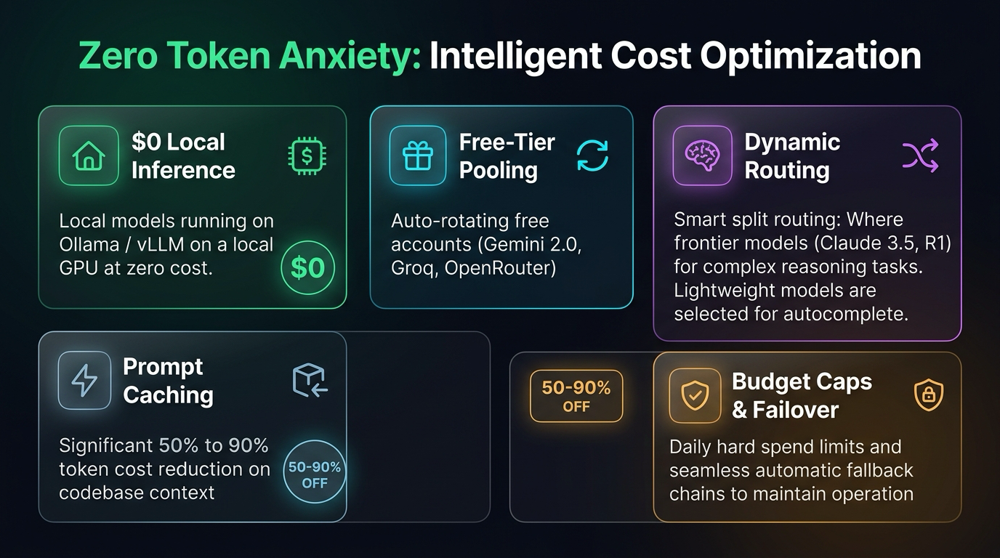

# OmniRoute AI Gateway for Cursor & コーディング IDE

[English](../README.md) | [简体中文](README.zh-CN.md) | [繁體中文](README.zh-TW.md) | [한국어](README.ko.md) | [日本語](README.ja.md)

---

**Cursor**、**Windsurf**、**Claude Code** のためのセルフホスト型 AI ゲートウェイデプロイスタックです。**[OmniRoute](https://github.com/diegosouzapw/OmniRoute)**、**Nginx**、**Cloudflare Tunnel** を **Docker Compose** でパッケージ化しています。

ルーターのインバウンドポートを開放することなく、パブリックインターネット経由でコーディング IDE や SDK クライアントをセルフホスト AI ゲートウェイに安全に接続し、**Server-Sent Events (SSE) リアルタイムストリーミング**と包括的な不正利用・予算保護を提供します。

---

### 💡 トークンの不安をゼロに：インテリジェントなコスト最適化

AI コーディングアシスタントは、リポジトリのインデックス作成やエージェントループによって大量のトークンを消費することがあります。OmniRoute はスマートなルーティングによってコストを最適化します：



---

## 🏛 アーキテクチャ概要


### 4 層の多層防御システム

1. **第 1 層：Cloudflare Edge 保護**：エッジで大規模 DDoS 攻撃や悪意のある Bot を遮断し、グローバル信頼の SSL 証明書を提供します。
2. **第 2 層：Zero Trust Access（パス分離認証）**：管理画面（Web UI）は SSO で保護し、`/v1/*` API パスは Bearer API キー通信用に SSO をバイパスします。
3. **第 3 層：Nginx リバースプロキシ**：
   * 公式の Cloudflare CIDR からクライアントの実 IP (`CF-Connecting-IP`) を正確に復元。
   * マルチゾーンレート制限（API: 1 req/s、バースト 10；ログイン: 5 req/min；UI: 10 req/s）および 10 MiB のリクエストボディ制限を適用。
   * バッファリングなしの SSE リアルタイムストリーミング (`proxy_buffering off;`) と 600 秒のタイムアウトを提供。
4. **第 4 層：OmniRoute アプリケーションエンジン**：正規の API キー検証、キーごとの使用量・セッション制限の適用、および上流プロバイダーの自動フェイルオーバーを管理。

---

## 🚀 クイックスタートガイド

### 1. 前提条件と Cloudflare Tunnel の作成
1. [Docker](https://docs.docker.com/get-docker/) および Docker Compose をインストールします。
2. [Cloudflare Zero Trust ダッシュボード](https://one.dash.cloudflare.com/)にログインします（無料プラン利用可能）。
3. **Networks** > **Tunnels** > **Add a Tunnel** をクリック > **Cloudflared** を選択。
4. トンネル名（例: `omniroute-tunnel`）を入力し、**Docker** を選択してトークン（`--token` 以降の文字列）をコピーします。
5. **Public Hostnames** タブで：
   * **Subdomain / Domain**：例: `ai` / `yourdomain.com`（URL: `ai.yourdomain.com`）。
   * **Service Type**：`HTTP`
   * **URL**：`nginx:80`（または `http://nginx:80`）。
6. トンネル設定を保存します。

---

### 2. 環境変数の設定
テンプレート設定ファイルをコピーします：
```bash
cp .env.example .env
```

`.env` を編集します：
```bash
# Cloudflare Tunnel Token を貼り付け
CLOUDFLARE_TUNNEL_TOKEN=eyJhIjoi...YOUR_TOKEN...

# 強力な管理者パスワードの生成: openssl rand -base64 16
INITIAL_PASSWORD=<生成したパスワードを貼り付け>

# 64 文字の Hex シークレットの生成: openssl rand -hex 32
JWT_SECRET=<生成したシークレットを貼り付け>

# パブリック URL（OAuth コールバックと Secure Cookie 用）
NEXT_PUBLIC_BASE_URL=https://ai.yourdomain.com
BASE_URL=https://ai.yourdomain.com

# デフォルトの Node Alpine ビルド
OMNIROUTE_DOCKERFILE=Dockerfile.v1.1
OMNIROUTE_IMAGE=omniroute:3.8.49
```

ファイルパーミッションを制限：
```bash
chmod 600 .env
```

---

### 3. スタックのビルドと起動
```bash
docker compose up -d
```

コンテナの状態を確認：
```bash
docker compose ps
```

---

### 4. Cloudflare Zero Trust Access の設定：パス分離と SSO 保護

Cursor や SDK が Bearer API キーで直接通信できるようにしつつ、Web 管理画面を SSO で保護するために、**Zero Trust ダッシュボード**（**Access** > **Applications**）でパス別ルールを設定します：

#### A. API バイパスアプリケーション (`/v1/*`)
1. **Self-Hosted** アプリケーションを追加。
2. **Application Name**：`Bypass LLM API v1`
3. **Domain / Path**：`ai.yourdomain.com` / `v1/*`
4. **Policy**：名称 `Allow API Traffic`、Action は `Bypass`、Include は `Everyone`（または特定の IP 範囲）。

#### B. ヘルスチェックバイパスアプリケーション (`/health`)
1. **Self-Hosted** アプリケーションを追加。
2. **Domain / Path**：`ai.yourdomain.com` / `health`
3. **Policy**：Action は `Bypass`、Include は `Everyone`。

#### C. ルート管理画面 SSO アプリケーション (`/`)
1. ルートドメインをカバーする **Self-Hosted** アプリケーションを追加（**Path** は空のまま）。
2. **Policy**：Action は `Allow`、Include は `Emails`（自身のメールアドレス）または SSO ID グループ（Google、GitHub）。

> **動作の仕組み：** Cloudflare は最も具体的なパスを優先して評価します。`/v1/*` へのリクエストは SSO をバイパスして OmniRoute で API キー認証され、Web 管理画面（`/`、`/dashboard`）へのアクセスには SSO 認証が要求されます。

---

### 5. Cursor IDE の設定

1. **Cursor Settings** (`Cmd + ,` または `Ctrl + ,`) > **Models** > **OpenAI API Key** を開きます。
2. **Override OpenAI Base URL** を有効化します：
   * **Base URL**：`https://ai.yourdomain.com/v1`
   > **⚠️ 重要：** 必ず `https://` を使用してください。`http://` を使用するとリダイレクトの問題により **`405 Method Not Allowed`** エラーが発生します。
3. **OpenAI API Key** 項目に：
   * OmniRoute ダッシュボードで作成した Gateway API Key を入力します。
4. Cursor Chat (`Cmd + L` または `Ctrl + L`) でテストすると、トークンがリアルタイムでストリーミングされます。

---

### 6. Web 管理画面へのアクセス

1. ブラウザで `https://ai.yourdomain.com/` にアクセスします。
2. Cloudflare Access（SSO / メールワンタイムパスワード）で認証します。
3. `.env` に設定した `INITIAL_PASSWORD` でログインします。
4. AI プロバイダーの API キー（Anthropic、OpenAI、DeepSeek、Google Gemini、Ollama など）を設定し、IDE 用のゲートウェイキーを生成します。

---

## 🧪 検証とテスト

### 1. ヘルスチェックと未認証拒否のテスト
```bash
# ヘルスチェック（200 OK が返ることを確認）
curl https://ai.yourdomain.com/health

# 未認証リクエストの即時拒否テスト（401 が返ることを確認）
curl -i https://ai.yourdomain.com/v1/chat/completions
```

### 2. モデル推論とリアルタイム SSE ストリーミングのテスト
```bash
# 通常レスポンステスト
curl https://ai.yourdomain.com/v1/chat/completions \
  -H "Content-Type: application/json" \
  -H "Authorization: Bearer <YOUR_OMNIROUTE_API_KEY>" \
  -d '{"model": "auto", "messages": [{"role": "user", "content": "Hello!"}]}'

# リアルタイム SSE ストリーミングテスト
curl -N https://ai.yourdomain.com/v1/chat/completions \
  -H "Content-Type: application/json" \
  -H "Authorization: Bearer <YOUR_OMNIROUTE_API_KEY>" \
  -d '{"model": "auto", "stream": true, "messages": [{"role": "user", "content": "Count 1 to 5"}]}'
```

---

## 💰 Cloudflare 料金について：$0.00 / 月（完全無料）

本構成は Cloudflare の永久無料プラン **Zero Trust Free Tier** で完全に動作します：

| Cloudflare サービス | 本スタックでの利用用途 | 無料枠の制限 | 費用 |
| :--- | :--- | :--- | :--- |
| **Cloudflare Tunnel (`cloudflared`)** | 安全なアウトバウンドリバースプロキシ | **トンネル数・帯域幅無制限** | **$0.00** |
| **Cloudflare Access (Zero Trust SSO)** | `/` 管理画面の SSO / OTP 保護 | **最大 50 名のアクティブユーザー** | **$0.00** |
| **Edge SSL / TLS 証明書** | カスタムドメインの Universal SSL | **自動更新 SSL 無制限** | **$0.00** |
| **Data Egress（送信トラフィック）** | モデル応答の IDE へのストリーミング | **データ転送料金無料** | **$0.00** |

---

## 🔐 実装されたセキュリティ強化

機密性の高いプロバイダー認証情報を保護し、意図しない利用料金の発生を防ぐ多層防御：

* **強化されたコンテナランタイム**：最小構成の Alpine イメージ（`node:22-alpine` または `oven/bun:alpine`）、`su-exec` による非 root ユーザー実行、`dumb-init` によるシグナルハンドリング。
* **ヘッダーのサニタイズと厳格な CORS**：アップストリーム転送前に未検証の `Cf-Access-*` ヘッダーを削除し、ワイルドカード CORS を無効化してクロスオリジンの不正利用を防止。
* **Nginx 未認証リクエストの事前遮断**：`/v1/*` へのリクエストに認証ヘッダー（`Authorization`、`x-api-key`、`x-goog-api-key`）が含まれているかを事前チェックし、未認証アクセスを即座に 401 で拒否。
* **実 IP 復元と信頼できるプロキシ設定**：公式の Cloudflare CIDR と静的トンネルコンテナ IP のみを信頼し、`CF-Connecting-IP` から正確なクライアント IP を復元。

### レート制限とクォータ制御

| 制御項目 | 設定値 | 目的 |
| :--- | :--- | :--- |
| **API リクエストレート** | 1 IP あたり 1 req/s (バースト 10) | IDE の正常なツールバーストを許可しつつ、自動スクレイピングを防止 |
| **同時推論接続数** | 1 IP あたり 8 / 全体で 12 | 接続枯渇攻撃から保護 |
| **キーごとの使用量・支出上限** | 60 RPM、1,000 req/日、$10/日 | クライアントキー漏洩時の影響範囲を極小化 |
| **ログイン試行** | 5 req/min (バースト 5) | 管理画面へのブルートフォース攻撃を防止 |
| **リクエストボディ / タイムアウト** | 10 MiB / 600 秒 | メモリ増幅を抑制し、長時間の SSE 生成を保証 |

---

*Built with Antigravity • Security settings verified with GPT Sol 5.6*
