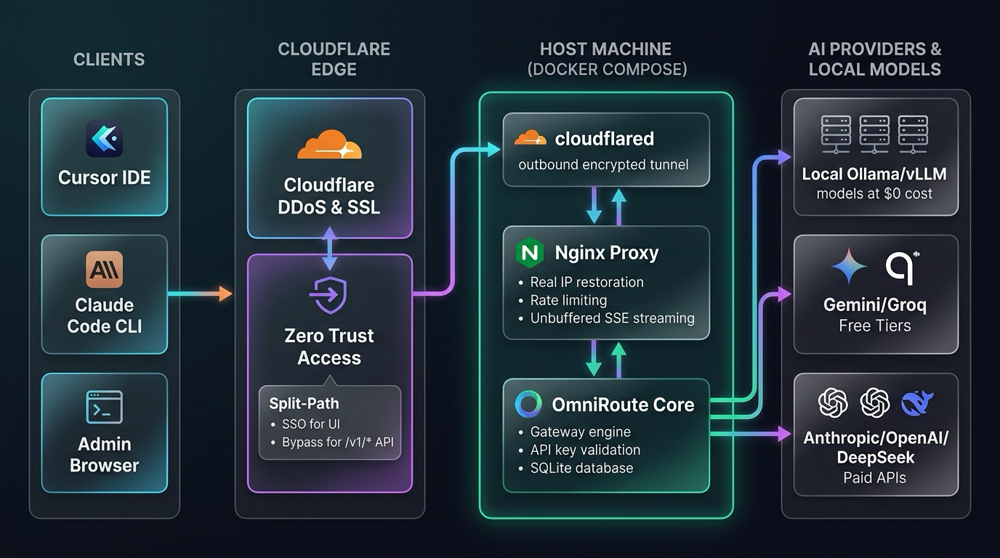

# OmniRoute + Nginx + Cloudflare Tunnel 部署指南

[English](../README.md) | [简体中文](README.zh-CN.md) | [繁體中文](README.zh-TW.md) | [한국어](README.ko.md) | [日本語](README.ja.md)

---

这是一个企业级、安全且支持自托管的 AI 网关（AI Gateway）部署方案，基于 **OmniRoute**（提供优化的 **Alpine / Bun** 极速运行时构建）、**Nginx** 反向代理与 **Cloudflare Tunnel**，并通过 **Docker Compose** 进行容器化编排。

该方案支持 **Cursor IDE**、**Claude Code** 以及各类基于 OpenAI SDK 开发的客户端，通过公共互联网以**超低延迟 Server-Sent Events (SSE) 流式传输**直连您的 OmniRoute 实例。无需在路由器开放任何入站端口，无需暴露源站服务器公网 IP，同时内置全方位防滥用与速率限制保护。

---

## 🏛 架构设计



---

## ⚡ 运行时与镜像选项 (Alpine & Bun)

本项目包含专属深度优化的 Alpine 多阶段 Docker 构建文件：

| 运行时选项 | Dockerfile | 镜像大小 | 适用场景 |
| :--- | :--- | :--- | :--- |
| **Node.js 22 Alpine** | `omniroute/Dockerfile.v1.1` | ~120 MB | 原生 C++ 模块 (`better-sqlite3`, `libsecret`) 兼容性极高，内存占用小。 |
| **Bun on Alpine** *(默认推荐)* | `omniroute/Dockerfile.v1.1.bun` | ~90 MB | 亚秒级冷启动速度，极高的 I/O 吞吐量与极低内存消耗。 |

您可以在 `.env` 文件中随时通过 `OMNIROUTE_DOCKERFILE=Dockerfile.v1.1.bun` 或 `Dockerfile.v1.1` 自由切换。

---

## ✨ 核心特性与安全防护

* **专属 Alpine / Bun 极速构建**：内置预编译原生模块，容器自动以 root 启动修正挂载目录权限后通过 `su-exec` 降权至普通用户 `omniroute`（UID 10001），并由 `dumb-init` 负责信号优雅管理。
* **零入站端口暴露**：通过 Cloudflare Tunnel 建立出站加密通道直连 Cloudflare 边缘节点，无需路由器端口映射，无公网 IP 暴露风险。
* **Cursor 专属低延迟 SSE 流式响应**：深度调优 `proxy_buffering off;`、`chunked_transfer_encoding on;` 以及 600 秒长连接超时，保障 Cursor IDE 实时逐 Token 吐字无卡顿。
* **真实客户端 IP 还原**：Nginx 精确解析 `CF-Connecting-IP` 与 Cloudflare 官方 IP CIDR 白名单，确保限流精确作用于真实发起者。
* **多区域独立限流体系**：
  * `/v1/` API 区域：`40 requests/second`（突发 burst 50），轻松应对多文件代码补全及并发上下文请求。
  * `/` Web 仪表盘区域：`30 requests/second`（突发 burst 50），保障网页端管理流畅度。
  * `/_next/static/`：静态资源与媒体文件独立缓存（365天），免除限流干扰。
* **资源耗尽与并发防护**：限制单 IP 最大并发连接数（`limit_conn 30`），限制请求体最大 25MB。
* **OWASP 安全响应头**：注入完整防护标头（`X-Frame-Options`、`X-Content-Type-Options: nosniff`、`Referrer-Policy`、`Permissions-Policy`）。

---

## 🚀 快速上手指南

### 1. 前置条件
* 已安装 [Docker](https://docs.docker.com/get-docker/) 与 Docker Compose。
* 拥有一个由 Cloudflare 解析管理的域名（免费版即可）。

---

### 2. 创建 Cloudflare Tunnel 隧道
1. 登录 [Cloudflare Zero Trust 控制台](https://one.dash.cloudflare.com/)。
2. 进入 **Networks** > **Tunnels** > 点击 **Add a Tunnel**。
3. 选择 **Cloudflared** 连接方式，并为隧道命名（例如 `omniroute-tunnel`）。
4. 在安装命令区域选择 **Docker**，复制 Token 字符串（即 `--token` 后面的完整字符串）。
5. 在 **Public Hostnames** 标签页中添加路由：
   * **Subdomain / Domain**：填写您的子域名与主域名（例如 `ai.yourdomain.com`）。
   * **Service Type**：`HTTP`
   * **URL**：`nginx:80`（或 `http://nginx:80`）。
6. 保存隧道配置。

---

### 3. 配置环境变量
复制环境配置模板：
```bash
cp .env.example .env
```

编辑 `.env` 文件并填入您的密钥信息：
```bash
# 粘贴您的 Cloudflare Tunnel Token
CLOUDFLARE_TUNNEL_TOKEN=eyJhIjoi...YOUR_TOKEN...

# 设置 OmniRoute Web 仪表盘的初始管理员密码
INITIAL_PASSWORD=YourSuperSecurePassword123!

# 生成用于 JWT 会话签名的 64 位 Hex 随机密钥 (openssl rand -hex 32)
JWT_SECRET=$(openssl rand -hex 32)

# 选择运行时构建文件 (Dockerfile.v1.1.bun = Bun Alpine, Dockerfile.v1.1 = Node Alpine)
OMNIROUTE_DOCKERFILE=Dockerfile.v1.1.bun
OMNIROUTE_PKG_VERSION=latest
```

---

### 4. 构建并启动服务
一键启动所有容器（Docker Compose 会根据配置自动构建镜像）：
```bash
docker compose up -d
```

查看容器运行状态：
```bash
docker compose ps
```

查看实时日志：
```bash
# 查看所有容器日志
docker compose logs -f

# 或查看单独容器日志
docker compose logs -f nginx
docker compose logs -f omniroute
docker compose logs -f cloudflared
```

---

## 🛡️ Cloudflare Zero Trust Access：路径级白名单与 SSO 认证保护

若您希望通过 Cloudflare Access 保护管理后台，同时允许外部开发工具（如 Cursor、Claude Code、Python SDK）免登录直接调用 `/v1/*` 接口，**最佳实践是针对不同路径创建独立的 Access 应用**。Cloudflare 会自动优先匹配最具体的路径规则。

配置步骤如下：

### 步骤 1：创建 API 绕过应用（API Bypass Application）
1. 打开 **Zero Trust 控制台** -> 导航至 **Access** > **Applications** -> 点击 **Add an Application**。
2. 选择 **Self-Hosted**。
3. 在 **Application Configuration** 部分：
   * **Application Name**：`Bypass LLM API v1`
   * **Subdomain & Domain**：输入您的域名（如 `ai.yourdomain.com`）。
   * **Path**：输入 `v1/*`。
4. 滚动到 **Policies** 策略配置区域：
   * **Policy Name**：`Allow API Traffic`
   * **Action**：选择 **Bypass**
   * **Rule Type**：
     * **Include**：选择 `Everyone` *(或选择 `IP Ranges` 仅限特定网段)*。
5. 点击保存应用。

### 步骤 2：创建健康检查绕过应用（Health Bypass Application）
重复上述步骤，为健康检查端点创建单独应用：
1. 新建 **Self-Hosted** 应用。
2. **Application Name**：`Bypass LLM Health`
3. **Subdomain & Domain**：输入您的域名（如 `ai.yourdomain.com`）。
4. **Path**：输入 `health`。
5. 策略设置为 **Action: Bypass**，**Include: Everyone**。
6. 点击保存。

### 步骤 3：保护根域名管理后台（Secure the Root Application）
配置主域名的 SSO 访问拦截：
1. 新建或编辑根 **Self-Hosted** 应用，域名填写 `ai.yourdomain.com`，**Path 字段保持完全留空**。
2. 配置严格策略：
   * **Action**：选择 **Allow**
   * **Include / Require**：选择 `Emails` *(例如 `your-email@example.com`)* 或身份提供商（Google、GitHub 等）。

> **运行机制**：Cloudflare 优先评估最具体的路径。因此对 `/v1/*` 和 `/health` 的请求将完全绕过 SSO 验证（允许外部工具使用 Bearer API Key 直接交互），而访问 `/` 与 `/dashboard` 时则会强制弹出 SSO 登录验证。

---

## 💻 Cursor IDE 配置连接

服务部署上线后：

1. 打开 Cursor 设置（`Cmd + ,` 或 `Ctrl + ,`）-> **Models** -> **OpenAI API Key**。
2. 点击 **Override OpenAI Base URL**：
   * **Base URL**：`https://ai.yourdomain.com/v1`（替换为您的实际域名）。
3. 在 **OpenAI API Key** 中：
   * 输入在 OmniRoute 仪表盘中生成的 API Key。
4. 在 Cursor Chat（`Cmd + L` 或 `Ctrl + L`）中发起对话，Token 将实时流式输出。

---

## 🔒 访问 Web 仪表盘

1. 在浏览器中打开：
   ```
   https://ai.yourdomain.com/
   ```
2. 通过 Cloudflare Access 完成身份认证（SSO 或邮箱一次性验证码）。
3. 输入 `.env` 中配置的 `INITIAL_PASSWORD` 登录 OmniRoute。
4. 在仪表盘中您可以：
   * 配置上游 AI 提供商密钥（OpenAI、Anthropic、DeepSeek、Groq、Google Gemini、OpenRouter 等）。
   * 为不同的 IDE 与项目生成专属网关 API Key。
   * 查看实时 Token 用量、延迟统计与上下文压缩效率。
   * 监控免费层提供商的配额状态（`/dashboard/free-tiers`）。

---

## 🧪 验证与测试

### 1. 测试健康检查
```bash
curl https://ai.yourdomain.com/health
# 预期返回: {"status":"ok","service":"omniroute-proxy"}
```

### 2. 测试缺少鉴权拦截
```bash
curl -i https://ai.yourdomain.com/v1/chat/completions
# 预期返回: HTTP/1.1 401 Unauthorized
```

### 3. 测试标准推理请求
```bash
curl https://ai.yourdomain.com/v1/chat/completions \
  -H "Content-Type: application/json" \
  -H "Authorization: Bearer <YOUR_OMNIROUTE_API_KEY>" \
  -d '{
    "model": "auto",
    "messages": [{"role": "user", "content": "Hello!"}]
  }'
```

### 4. 测试实时 SSE 流式输出
```bash
curl -N https://ai.yourdomain.com/v1/chat/completions \
  -H "Content-Type: application/json" \
  -H "Authorization: Bearer <YOUR_OMNIROUTE_API_KEY>" \
  -d '{
    "model": "auto",
    "stream": true,
    "messages": [{"role": "user", "content": "请从 1 数到 10"}]
  }'
```

---

## 📦 远端服务器离线打包部署

如果您的生产服务器无法连接编译网络，可以在本地一键打包完整离线镜像与配置文件：

### 1. 本地打包构建
```bash
# 默认使用 Bun on Alpine 构建：
./scripts/package.sh bun

# 或使用 Node.js Alpine 构建：
./scripts/package.sh

# 如目标机为 ARM64 架构（如树莓派、ARM 云服务器）：
TARGET_PLATFORM=linux/arm64 ./scripts/package.sh
```

构建完成后将在 `dist/` 目录下生成离线安装包 `dist/omniroute-deploy-YYYYMMDD_HHMMSS.tar.gz`。

### 2. 传输并在远端一键启动
```bash
# 1. 复制安装包到远端服务器
scp dist/omniroute-deploy-*.tar.gz user@remote-server:/opt/omniroute/

# 2. 登录远端服务器并解压
ssh user@remote-server
cd /opt/omniroute/
tar -xzf omniroute-deploy-*.tar.gz

# 3. 配置密钥
cp .env.example .env
nano .env

# 4. 启动服务（脚本将自动导入本地镜像并启动容器）
./start.sh
```

---

---

## 🚢 在 Mac 本地使用 Colima 构建 x64 镜像并推送到 GitHub (GHCR)

您可以在 Apple Silicon 或 Intel Mac 上直接使用 **Colima**（配合 Rosetta 硬件加速）交叉编译 x64 (`linux/amd64`) OmniRoute 镜像，并推送到 **GitHub Container Registry (`ghcr.io`)**，支持从 **`1.0` 开始的版本号自动递增**。

### 1. 在 macOS 启动 Colima

在 Apple Silicon (M1/M2/M3/M4) 上，使用 Virtualization 框架 (`vz`) 与 Rosetta 2 启动 Colima，获得近乎原生的 x86_64 编译性能：

```bash
colima start --arch aarch64 --vm-type vz --vz-rosetta
```

*(Intel Mac 用户直接运行：`colima start`)*

---

### 2. 登录 GitHub 容器镜像仓库 (GHCR)

1. 创建 GitHub Personal Access Token (PAT)：
   * 进入 **GitHub** -> **Settings** -> **Developer settings** -> **Personal access tokens** -> **Tokens (classic)**。
   * 勾选权限：`write:packages`、`read:packages`、`delete:packages`。
2. 登录 GHCR：
   ```bash
   echo $CR_PAT | docker login ghcr.io -u <你的GitHub用户名> --password-stdin
   ```

---

### 3. 一键构建并推送（自动递增版本号）

```bash
# 自动递增版本 (1.0 -> 1.1 -> 1.2)，编译 x64 Bun 镜像并推送至 GHCR:
./scripts/build-and-push.sh

# 编译 Node.js Alpine 镜像：
./scripts/build-and-push.sh node

# 递增 patch 版本号（例如 1.0.1）：
./scripts/build-and-push.sh --bump patch

# 指定固定 Tag：
./scripts/build-and-push.sh --tag 2.0.0

# 预览构建命令（dry-run）：
./scripts/build-and-push.sh --dry-run
```

**脚本自动完成：**
1. 校验 Colima 与 Docker Buildx 运行状态。
2. 从 `.image-version` 读取当前版本（起始为 `1.0`），计算下次版本（如 `1.1`）。
3. 使用 Docker Buildx 交叉编译 `linux/amd64` 镜像。
4. 推送 `ghcr.io/<用户名>/omniroute:1.x` 及 `ghcr.io/<用户名>/omniroute:latest`。
5. 自动更新 `.image-version` 并同步 `.env` 中的 `OMNIROUTE_IMAGE_TAG`。

---

### 4. 远端服务器通过 Docker Compose 拉取运行

在远端服务器上：
1. 确保 `.env` 中已配置 `GITHUB_USERNAME` 与 `OMNIROUTE_IMAGE`。
2. 若 GHCR 包设置为 Private，先执行一次 `docker login ghcr.io`（若在 GitHub 中将 Package 设为 Public 则无需登录）。
3. 拉取并启动：
   ```bash
   docker compose pull omniroute
   docker compose up -d
   ```

---

## 📁 目录结构说明

```
OmniRoute/
├── docker-compose.yaml             # 多容器编排配置（支持 GHCR 镜像拉取）
├── .env.example                    # 环境变量配置模板（含 GHCR 配置项）
├── .image-version                  # 镜像版本追踪文件 (起始 1.0, 1.1...)
├── .gitignore                      # Git 忽略规则
├── README.md                       # 英文主文档
├── doc/                            # 多语言文档目录 (中/繁/韩/日)
├── scripts/
│   ├── build-and-push.sh           # Mac (Colima) x64 镜像构建与 GHCR 推送脚本
│   └── package.sh                  # 独立部署离线打包脚本
├── omniroute/
│   ├── Dockerfile.v1.1             # Node.js 22 Alpine 生产镜像构建文件
│   ├── Dockerfile.v1.1.bun         # Bun Alpine 高性能镜像构建文件
│   ├── docker-entrypoint.sh        # su-exec 权限降权与数据卷初始化脚本
│   └── data/                       # SQLite 数据库持久化存储目录
└── nginx/
    ├── nginx.conf                  # Nginx 核心配置与限流区域定义
    ├── conf.d/
    │   └── omniroute.conf          # 路由代理、静态缓存与错误处理
    ├── logs/                       # 访问日志与错误日志
    └── includes/
        ├── cloudflare-real-ip.conf # Cloudflare 真实 IP 白名单配置
        ├── security-headers.conf   # OWASP 安全标头配置
        └── streaming-proxy.conf    # SSE、WebSocket 与 Cloudflare Access 标头透传
```

---

## 🛠 常用维护命令

* **重新构建并更新镜像**：
  ```bash
  docker compose up -d --build
  ```
* **切换运行时环境**：
  在 `.env` 中修改 `OMNIROUTE_DOCKERFILE=Dockerfile.v1.1.bun` 或 `Dockerfile.v1.1`，执行：
  ```bash
  docker compose up -d
  ```
* **停止所有服务**：
  ```bash
  docker compose down
  ```
